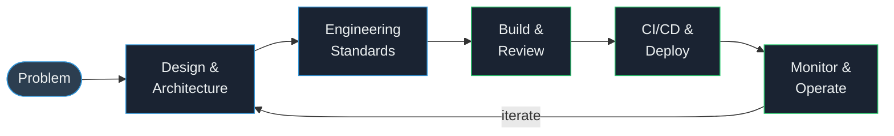

<div align="center">



<br/>

[](https://github.com/ahmad-rafee)

<br/>

<a href="https://linkedin.com/in/ahmad-rafee"></a>
&nbsp;
<a href="mailto:ahmad.rafee@hotmail.com"></a>
&nbsp;


</div>

---

## About Me

I'm a senior software engineer and tech lead with 5+ years of production experience across enterprise platforms, healthcare systems, and AI products. I work across the full stack and own delivery end to end — architecture, implementation, infrastructure, and ops.

I've shipped in PHP/Laravel, Java/Spring Boot, Python, NestJS, and TypeScript. The stack changes, the fundamentals don't: readable code, solid APIs, tests that mean something, and systems that don't wake you up at 3am.

I hold an **MSc in Computer Science from Warsaw University of Technology** (2022–2025) and I'm currently doing a second MSc at the **Swiss Joint Master of Computer Science (SJMCS)** in Bern.

---

## What I'm good at

```text
System Design        distributed systems, API design, multi-tenant architecture, event-driven patterns
Tech Leadership      architecture reviews, engineering standards, cross-team alignment
Team Leadership      mentoring, code reviews, sprint planning, building engineering culture
DevOps & Ops         CI/CD, Kubernetes, incident response, SLOs, runbooks
Code Quality         SOLID, clean architecture, DDD, legacy refactoring
Security             OWASP, auth/authz, compliance-sensitive environments
Observability        structured logging, metrics, alerting, post-mortems
```

---

## Tech

**Backend**


**Frontend**


**Data**


**DevOps & Cloud**


---

## Selected Work

| Project | What I did |
|---|---|
| **ZadAlkhier** | Enterprise electricity management platform — 5 services, multi-node k3s, DigitalOcean managed DBs, Cloudflare R2 backups, bilingual EN/AR, offline-first mobile sync |
| **Deeepo** | AI tutoring platform for Saudi GAT prep — LangGraph agents, RAG/pgvector, HITL audit loop, multi-model evaluation, GKE + Helm + Terraform |
| **Langmark** | Live German learning PWA — AI reading/grammar/writing, Keycloak SSO, self-managed k3s |
| **Cloud ERP** | Multi-tenant ERP for hundreds of businesses — one DB per tenant, full ops ownership |
| **Healthcare API** | Refactored a live Python backend in a compliance-sensitive environment with no CI/CD disruption |
| **CI/CD Overhaul** | Rebuilt pipelines with Docker + K8s — cut deploy time by 80%, went from monthly to bi-weekly releases |

---

## Projects in Detail

### ZadAlkhier — Electricity Subscription Management

Five-service platform for managing electricity subscriptions, meter readings, billing, and cashier operations. Bilingual (EN/AR) throughout, with a field operator mobile app that works offline.

- **Customer Portal (API)** — Laravel 12. Built a generic repository/filter/export layer that powers dynamic column filters and Excel exports with translated headers across the whole app. Meter reading anomaly detection (meter swaps, readings that go backwards). JWT + Spatie RBAC, Laravel Horizon for job queues, PHPUnit + Behat, OpenAPI docs.
- **Customer Portal (UI)** — Vue 3 + TypeScript. Module-per-feature structure, PrimeVue DataTable wired to the same filter schema as the backend, full EN/AR i18n, Vitest + Playwright.
- **Reporting Service** — NestJS. Template library, report catalog, execution runtime, and Gotenberg integration for PDF generation via headless Chrome.
- **Mobile sync** — field workers operate offline; the `/sync` endpoint accepts batched writes into a staging layer and processes them async via Horizon.
- **Infrastructure** — multi-node k3s cluster, six namespaces, Helm charts per service, Terraform on DigitalOcean. Elasticsearch + Kibana for logs. Zitadel for OAuth2/OIDC across all services.
- **Data safety** — DigitalOcean Managed Databases (auto-failover, PITR), backups to Cloudflare R2.

`PHP · Laravel 12 · Vue 3 · TypeScript · NestJS · PostgreSQL · Redis · Gotenberg · Zitadel · Elasticsearch · Kubernetes · Helm · Terraform · DigitalOcean · Cloudflare R2`

---

### Deeepo — AI Tutoring for Saudi GAT Prep

AI tutoring system for the Saudi General Aptitude Test. Students chat with an AI tutor that pulls from a bank of expert-vetted questions using RAG, adapts its teaching style via configurable personas, and gets monitored by human experts through an audit pipeline.

- **Agent** — LangGraph with tool-calling and SSE streaming. Supports bilingual RTL/LTR and renders LaTeX math via KaTeX. Built an arabization layer that converts Western digits to Arabic-Indic numerals in prose without touching math/code spans (KaTeX breaks on Arabic digits).
- **RAG** — pgvector semantic search over approved questions and lessons. Prompts are built dynamically from the persona contract + student mastery state + retrieved content.
- **HITL loop** — sessions get sentiment-scored at close; flagged ones go into an expert audit queue with scoring on persona alignment, pedagogical quality, and emotional effect. Audit results feed back into persona performance scores; personas that drop below threshold get deactivated automatically.
- **Model evaluation** — ran structured QA matrices across GPT-4o-mini, Qwen, and others before committing to a model.
- **Infrastructure** — GKE provisioned with Terraform, Helm deployments, GitHub Actions CI/CD, Celery + Redis for async work.

`Python · Django · LangGraph · pgvector · Next.js · Vercel AI SDK · PostgreSQL · Redis · Celery · Docker · Kubernetes · Helm · Terraform · Google Cloud (GKE)`

---

### Langmark — German Learning PWA

Personal project, live at [langmark.psws.ch](https://langmark.psws.ch). A mobile-first web app for learning German with three AI-assisted modes.

- **Reading** — paste or generate a German paragraph; tap any word or phrase to translate it and add it to your vocab bank; finish reading and take an AI-generated comprehension test.
- **Grammar** — on first use, the AI drafts a 3-level topic tree and you approve it. Then practice per topic in three modes (fill-in, true/false, free writing) with AI grading and per-mistake explanations.
- **Writing** — write a German text on any topic, get scored on grammar, vocabulary, and topic relevance, with a corrected version and itemised mistake list.
- Auth via Keycloak (PKCE, self-registration). Every table scoped by the token's `sub` claim.
- Deployed on a self-managed k3s cluster with Traefik + cert-manager. Hit a tricky DNS issue where the cluster's search domain was hijacking `openrouter.ai` to a private IP; fixed by setting `ndots=1` on the backend deployment.

`React 18 · TypeScript · NestJS · PostgreSQL · Keycloak · OpenRouter · Docker · Kubernetes (k3s) · Tailwind · Vite`

---

## How I lead

As a **tech lead** I set the architecture, run design reviews, and keep the codebase from turning into a mess. I stay hands-on — I'm not the person who draws boxes on a whiteboard and disappears.

As a **team lead** I do 1-on-1s, unblock people, and give direct feedback. I care about the team more than the process.

As an **ops lead** I define SLOs, own the runbooks, set up monitoring, and make sure incidents have proper post-mortems instead of just getting closed.

---

## Timeline

| Period | | |
|---|---|---|
| 2025 – now | MSc Computer Science | SJMCS, Bern (Swiss federal universities) |
| 2025 – now | Sr. Software Engineer Consultant | TechCare.health, Jordan (remote) |
| 2025 | AI & Backend Engineer (Consultant) | Scriptum-Zeta, Germany (remote) |
| 2024 – 2025 | Sr. Software Engineer & Ops Lead | Business Space, Riyadh (remote) |
| 2022 – 2025 | MSc Computer Science | Warsaw University of Technology, Poland |
| 2020 – 2023 | Software Engineer & Team Lead | Altariq Systems, Gaza |
| 2019 – 2020 | Software Developer | Ashour Workshops, Gaza |

---

## Right now

- Finishing my second MSc at SJMCS, Bern
- Consulting on AI-integrated backend systems
- Working toward CKAD

---

## How I think about a project



---

<div align="center">
<sub>Bern, Switzerland &nbsp;·&nbsp; Authorized to work in Switzerland &nbsp;·&nbsp; Open to senior and lead roles</sub>
</div>
